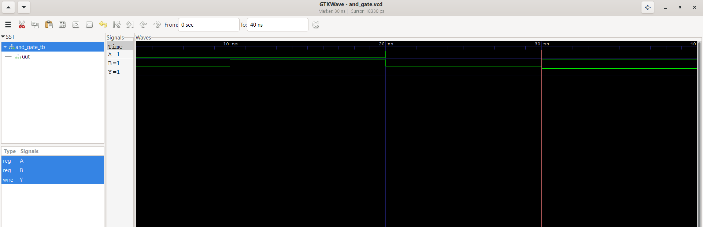
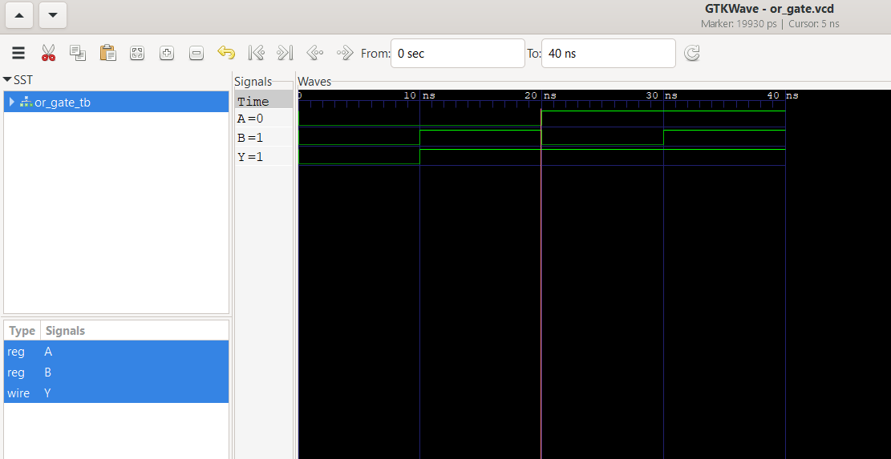
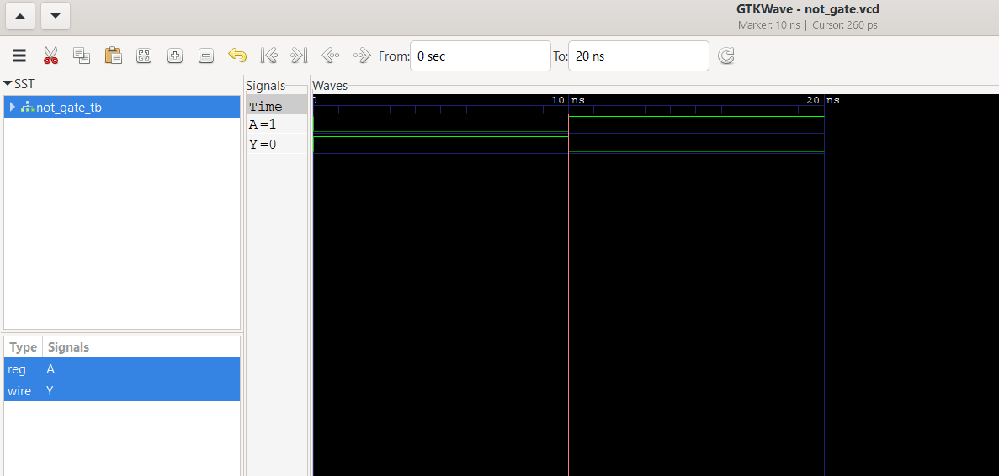
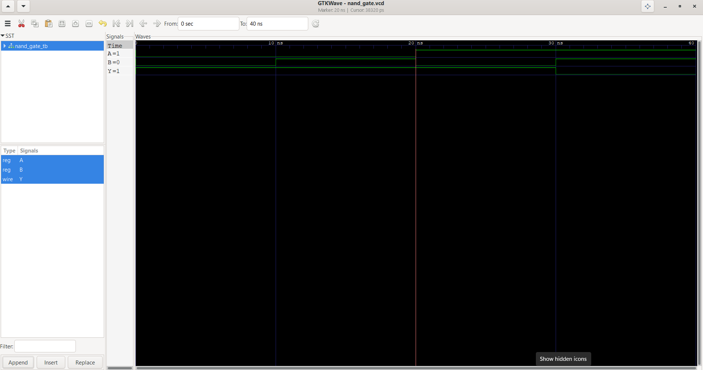
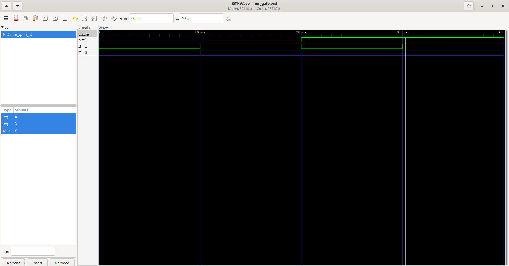

# Verilog HDL Projects

[]()
[]()
[]()
[]()

A comprehensive collection of **Verilog HDL projects** covering digital logic design, RTL implementation, simulation, waveform analysis, communication protocols, and processor design.

---

# Overview

This repository is a structured learning portfolio for digital hardware design using **Verilog HDL**.

Each project includes:

- ✔ RTL Design
- ✔ Testbench
- ✔ Simulation
- ✔ GTKWave Waveforms
- ✔ Documentation

The repository begins with fundamental combinational logic circuits and progressively covers advanced digital systems such as **UART, SPI, I²C, FIFO, and a RISC-V Processor**.

---

# Repository Structure

| Folder | Description |
|---------|-------------|
| 📁 01-Logic-Gates | Basic logic gates (AND, OR, NOT, NAND, NOR, XOR, XNOR) |
| 📁 02-Multiplexer | Multiplexers and Demultiplexers |
| 📁 03-Encoder-Decoder | Encoders and Decoders |
| 📁 04-Adders-Subtractors | Half Adder, Full Adder, Subtractor |
| 📁 05-ALU | Arithmetic Logic Unit |
| 📁 06-Flip-Flops | SR, D, JK, T Flip-Flops |
| 📁 07-Counters | Synchronous and Asynchronous Counters |
| 📁 08-Traffic-Light-Controller | FSM-based Traffic Light Controller |
| 📁 09-UART | Universal Asynchronous Receiver Transmitter |
| 📁 10-SPI | Serial Peripheral Interface |
| 📁 11-I2C | Inter-Integrated Circuit |
| 📁 12-FIFO | First-In First-Out Memory |
| 📁 13-RISCV-Processor | Single-Cycle RISC-V Processor |

---

# Tools

| Tool | Purpose |
|------|---------|
| Verilog HDL | RTL Design |
| Icarus Verilog | Compilation & Simulation |
| GTKWave | Waveform Analysis |
| Git | Version Control |
| GitHub | Repository Hosting |
| Visual Studio Code | Code Editor |

---

# Getting Started

## Clone the Repository

```bash
git clone https://github.com/sakshigalle/Verilog-HDL-Projects.git

cd Verilog-HDL-Projects
```

## Compile

Example (AND Gate)

```bash
iverilog -o sim \
01-Logic-Gates/rtl/and_gate.v \
01-Logic-Gates/tb/and_gate_tb.v
```

## Run Simulation

```bash
vvp sim
```

## Open Waveform

```bash
gtkwave and_gate.vcd
```

---

# Waveforms

### AND Gate

<p align="center">

</p>

### OR Gate

<p align="center">

</p>

### NOT Gate

<p align="center">

</p>

### NAND Gate

<p align="center">

</p>

### NOR Gate

<p align="center">

</p>

---

# Learning Roadmap

- ✅ Logic Gates
- ⬜ Multiplexers
- ⬜ Encoders & Decoders
- ⬜ Adders & Subtractors
- ⬜ Arithmetic Logic Unit (ALU)
- ⬜ Flip-Flops
- ⬜ Counters
- ⬜ Traffic Light Controller
- ⬜ UART
- ⬜ SPI
- ⬜ I²C
- ⬜ FIFO
- ⬜ RISC-V Processor

---

# Contributing

Contributions are welcome.

If you'd like to improve this repository:

- Open an Issue to report bugs or suggest features.
- Fork the repository.
- Submit a Pull Request with your improvements.

---

# Support

If you found this repository useful, consider giving it a ⭐ on GitHub.

Happy Coding!
